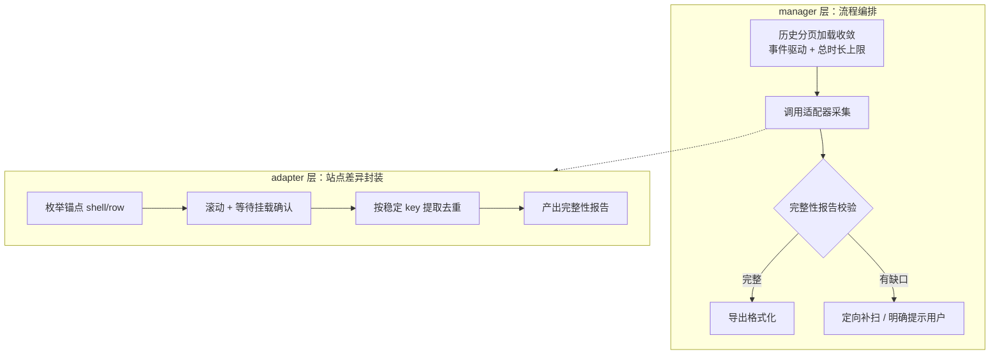

# 虚拟滚动站点长对话导出完整性技术方案

> 创建日期：2026-08-23
> 涉及模块：`src/core/conversation/manager.ts`、`src/adapters/chatgpt.ts`、`src/adapters/doubao.ts`、`src/adapters/deepseek.ts`、`src/adapters/aistudio.ts`、`src/adapters/base.ts`、`src/utils/exporter.ts`
> 关联需求：[Issue #780](https://github.com/urzeye/ophel/issues/780)（Doubao 导出不确定）、[Issue #117 评论](https://github.com/urzeye/ophel/issues/117#issuecomment-5382242329)（ChatGPT 长对话导出缺段）
> 关联文档：`export-pipeline-optimization-plan.md`（导出内容清洗管道，与本文的"采集完整性"正交）

---

## 1. 背景与问题

### 1.1 用户反馈

- **#780（Doubao，v1.1.5）**：同一对话重复导出结果不确定。短样本 19 条消息但末两条互换；长虚拟滚动样本两次导出分别为 343 与 425 条，稳定交集只有 298 条，并伴随重复记录与图片引用漂移；一次 Markdown 导出停留在 "Preparing export" 超过 296 秒未产出文件。
- **#117 评论（ChatGPT，2026-08-22，现行版本）**：长对话 Markdown 导出缺若干段，第三方工具可完整导出。注意此时 ChatGPT 的 turn 驱动导出（#514，2026-05-19 引入）早已发布，说明现行方案仍有残余缺陷。

### 1.2 根因定性

导出采集层目前并存两种范式：

| 范式 | 站点 | 特征 |
| --- | --- | --- |
| 固定间隔盲扫（旧） | Doubao（120ms/位）、DeepSeek（80ms/位） | 预算滚动位置 → 固定 sleep → 读当前视口 → 按内容/位置合并 |
| 目标驱动 + 挂载确认（新） | ChatGPT、AI Studio、Claude | 枚举锚点（turn shell / 虚拟行）→ 逐个滚动 → 轮询等待挂载 → 提取 → 重试 |

旧范式没有任何"内容已渲染"的确认机制，新范式缺少完整性校验与失败上报。两者共同的问题是：**采集失败时静默降级，用户拿到残缺文件却毫不知情**。

---

## 2. 现状盘点：各站点虚拟化技术差异

这些站点都用了虚拟滚动，但实现技术、DOM 结构、可用稳定标识各不相同，方案必须按站点分别设计，不能套同一个采集器。

| 站点 | 虚拟化实现 | 结构特征 | 可用稳定标识 | 当前采集方式 |
| --- | --- | --- | --- | --- |
| ChatGPT | 自有方案：离屏 turn 保留 `section` 壳与 `--last-known-height` 高度占位，内容 `[data-message-author-role]` 被卸载 | `section[data-turn][data-turn-id]`，`data-testid="conversation-turn-N"` | turn-N 为从 1 开始的连续整数，另有 `data-turn-id`、`data-message-id` | turn 驱动遍历 + `waitForTurnMessageMounted`（900ms，retry 1800ms） |
| Doubao | 自研 vlist：`[class*="v_list_scroller"]` 加 `[data-name="scroll_holder"]` 定高占位 | 行 `.v_list_row`，行内 `data-message-id`；行 style 含 `--cls: r-N-...`（行号）与 `--vlist-row-transform-y`（行顶偏移）；`data-observe-row="block_<id>"` | 行号 `--cls r-N-` 连续，`data-message-id` | 固定 120ms 步进盲扫 + key 合并 |
| DeepSeek | `.ds-virtual-list` / `.ds-virtual-list-items` / `.ds-virtual-list-visible-items` | 消息 `.ds-message`，assistant 含 `.ds-markdown` | 未发现消息级稳定 id（待实测确认） | 固定 80ms 步进盲扫 + 相邻批次 overlap 序列合并 |
| AI Studio | Angular 内部虚拟化：`ms-chat-turn` 离屏卸载 `.turn-content`，保留高度占位 | turn id 为 `turn-<uuid>`（非连续，不能做缺口检测） | turn DOM 顺序、`ms-chat-turn` 总数 | DOM 迭代 + `waitForTurnContentMounted`（1.8s，retry 5s），兜底退回旧扫 |
| Claude | Rocksteady：仅可见行挂载，其余为高度 spacer | 行有稳定 index | 行 index + 消息总数 oracle | index 键 Map 采集，两遍扫描，不足总数即抛错 |

Claude（#782）是仓内已验证的最佳范式：稳定序号键 + 总数 oracle + 多遍扫描 + 采不齐就显式失败。本方案将其抽象为通用契约，向其他站点推广。

---

## 3. 已确认问题清单

### P0 — 直接导致内容缺失/错乱

1. **Doubao 扫描无挂载确认**（`doubao.ts` `collectDoubaoExportSnapshotsByScrollSweep`）：固定 `sleep(120)` 后即读取，虚拟行未渲染完成时整段缺失。这是 343 vs 425 的直接原因。
2. **Doubao 去重 key 双轨制**（`getDoubaoExportMessageKey`）：有 `data-message-id` 时用 `role:id`，无 id 时退化为 `role:content:hash:order`。同一条消息在不同批次可能落入两个命名空间，产生重复。
3. **Doubao 排序键漂移**（`getDoubaoExportMessageOrder` → `getElementVirtualScrollTop`）：order 取自 `--vlist-row-transform-y` 加行内偏移，图片异步加载撑高上方的行后数值变化，merge 取 `Math.min` 改写，导致相邻消息互换（"末两条交换"）。
4. **DeepSeek overlap 合并脆弱**（`mergeExportMessageBatch`）：要求相邻批次严格序列相等；某批因未渲染缺头/尾时失配则整批 append 产生重复；缺中段则永久丢失。
5. **manager 历史分页加载提前终止**（`manager.ts` `withConversationExportData` 内 loading-history 循环）：scrollHeight 连续 3 次 × 500ms 不变即判定加载完。慢网络下单页 fetch 超 1.5s 被误判，ChatGPT 等站点旧 turn 的 shell 从未进入 DOM，开头若干段静默丢失。且 `maxRetries = 50` 是死代码（高度变化即清零、不变则 3 次就 break，永远触达不到 50）。

### P1 — 现行新范式的残余缺陷（#117 的根因候选）

6. **ChatGPT 挂载超时的 turn 静默丢弃**：900ms 加 1800ms 两轮后放弃，无日志、无用户提示。长对话逐个快速滚动时，站点 IntersectionObserver 与渲染在资源压力下可能跟不上。
7. **ChatGPT 抓到不等于抓全**：`turnHasMountedMessage` 只看有无非空文本，长 markdown 分块渲染中即返回 true，提取出截断内容；retry 只覆盖"完全没抓到"的 turn，残缺 snapshot 不会重抓。
8. **ChatGPT turnKey 内容兜底碰撞**：无 `data-turn-id` 时退化为 `role:content:<前120字符>`，重复提问（"继续"）或纯图片 turn 前缀相同即在 Map 中互相覆盖。
9. **ChatGPT turn shell 留存假设未验证**：turn 驱动方案建立在"离屏 turn 保留 shell"的 5 月观察（60 轮样本）上。8 月站点改版（#819）后超长对话是否仍然成立需实测；若 shell 被卸载，`getAllTurnShellsSorted` 的前提失效。

### P2 — 健壮性与体验

10. **全链路无完整性校验**：没有任何"应抓 N 条、实抓 M 条"的比对；缺了不告警、不补抓。
11. **资产下载无超时**（`exporter.ts` `resolveAssetData` 的 `fetch` 无 `AbortSignal`）：单个挂起的图片请求可让 ZIP 打包永远等待。
12. **失败只写 console**：导出失败返回 null，overlay 无明确错误态。#780 的 296 秒 "Preparing export" 是扫描耗时叠加无进度反馈的共同结果（Doubao 扫描发生在 preparing 阶段，425 条约 350 个位置 ×（120ms sleep 加全视口 markdown 转换加资产收集））。

---

## 4. 目标设计

### 4.1 分层职责



- **Manager 层**只做流程编排：历史加载收敛、调用采集、校验完整性报告、失败时显式报错/提示。不含站点知识。
- **Adapter 层**封装站点差异：锚点枚举、挂载判定、稳定 key、完整性 oracle。站点特定逻辑不得上泄。
- **完整性是第一等公民**：采集结果必须携带报告，缺口的最终去向只有两种——补抓成功，或用户可见的"可能不完整"提示；禁止静默出文件。

### 4.2 采集契约（适配器可选实现，增量引入）

```ts
/** 采集完整性报告：随消息一起返回，供 manager 校验与提示 */
interface ExportCollectionReport {
  /** 站点 oracle 给出的应有消息/锚点总数；无法获知时为 null */
  expectedCount: number | null
  /** 实际采集到的锚点数 */
  collectedCount: number
  /** 连续性校验发现的缺口（如缺失的 turn-N / 行号），无校验能力时为空数组 */
  missingAnchors: string[]
  /** 是否有内容疑似截断的条目（抓到了但可能不全） */
  hasTruncated: boolean
}

interface VirtualExportCollectResult {
  messages: ExportMessage[]
  report: ExportCollectionReport
}
```

- 在 `SiteAdapter` 新增可选方法 `collectExportMessagesWithReport(context)`；未实现的适配器走现有 `extractExportMessages` 路径，行为不变。
- manager 侧消费报告：`missingAnchors` 非空或 `collectedCount < expectedCount` 时，先触发一次适配器定向补扫；仍有缺则在导出完成时 toast 明示"导出可能不完整（缺 N 条）"，并在文件 metadata 中记录。**不允许无提示静默产出**。
- 现有 `ExportConfig`、`mountExportSnapshot`、`prepareConversationExport/restoreConversationAfterExport` 生命周期全部保留，新契约是增量而非替换。

### 4.3 完整性 oracle 的站点实现

| 站点 | oracle | 缺口检测 |
| --- | --- | --- |
| ChatGPT | `conversation-turn-N` 连续整数序列 | 起始 N > 1 说明历史未加载完，loading-history 收敛后做有界补载（已实现）；中间缺号则定向补抓对应 shell |
| Doubao | `--cls r-N-` 行号连续序列 | 缺号行按行号定向滚动补抓 |
| DeepSeek | 无序号（待实测行属性）；用"可见行数稳定 + 扫描位置覆盖全高"做弱校验 | 无硬缺口检测，靠挂载确认消除缺失源头 |
| AI Studio | DOM 中 `ms-chat-turn` 总数 vs 已处理数 | 未处理/未挂载 turn 列表定向重试 |

### 4.4 各站点迁移方案

#### ChatGPT（修残余缺陷，不重写）

1. 采集结束做 turn-N 连续性校验（起始值 + 缺号），缺则定向补抓一轮，仍缺则上报。
2. retry 范围从"完全没抓到的 turn"扩展到"疑似截断的 turn"（挂载中状态、末尾仍在流式标记）。
3. turnKey 内容兜底追加首见序号后缀，消除重复提问碰撞。
4. 实测超长对话（300+ turn）shell 留存假设；若不成立，改为"边滚动边枚举 shell"的两段式（先滚一遍建 shell 清单，再逐个采集）。
5. loading-history 与采集联动（已实现）：高度收敛后 shell 起始 N > 1 时继续滚顶补载（30s 有界预算，避免无完整历史的对话卡死），仍缺则标记"历史可能不完整"并提示。

#### Doubao（重写为行号驱动，修 #780）

1. 用行号 `--cls r-N-` 作为主锚点：枚举当前 DOM 行号集合，按行号升序逐行滚动定位（沿用 `scrollVirtualContainerTo` 加 `__bypassLock`），**轮询等待该行内 `data-message-id` 节点出现且内容非空**后再提取，替代固定 120ms sleep。
2. key 统一为 `data-message-id`（辅证 `data-observe-row` 的 block id）；无 id 的瞬时态消息不入集，等下一次挂载确认，废弃 `content:hash:order` 兜底轨。
3. 排序主键用行号（单调、不受图片加载影响），次键用首见序号；废弃 transform-y 派生的 order。
4. 行号缺口检测 + 定向补扫；总数无法预知时以"连续两遍扫描无新增"收敛。
5. **保留并显式化与大纲缓存的耦合**：Doubao 无原生 TOC，导出过程顺带吸收 outline 缓存是现有行为（`trimOutlineCache`/`mergeCachedOutlineItems`），重写时该副作用要保留并在注释中说明，避免导出后大纲退化。
6. 新采集器检测锚点枚举为空（站点结构变更）时自动回退现行 sweep，保证不比现在差。

#### DeepSeek（消除 overlap 合并，加挂载确认）

1. 废弃 overlap 序列合并，改为 key-based Map 合并：key 用"行在 `.ds-virtual-list-items` 中的稳定标识"（需实测行属性，如 data-index/key）；若无任何稳定标识，用 `role + 内容哈希 + 首见顺序` 复合 key，并对相同内容的消息按出现序号区分。
2. 每个位置等待"`.ds-virtual-list-visible-items` 行数与首行内容稳定"再读取（轮询 + 超时），替代固定 80ms。
3. 与 Doubao 相同的结构变更回退：新路径枚举不到锚点时回退现行 sweep。

#### AI Studio（收尾补强）

1. 现行 DOM 迭代 + retry 保留；补采集报告：未挂载成功的 turn 列表进 `missingAnchors` 并定向重试一轮。
2. 兜底 sweep 路径与 DeepSeek 同款问题，加同样的挂载确认。

#### Manager（公共链路）

1. **loading-history 收敛改造**：高度不变不再直接视为完成——收敛后询问适配器历史起点是否未加载完（`hasUnloadedConversationHistory`，ChatGPT 用起始 `conversation-turn-N > 1` 判定，复用采集锚点而非易变的 spinner 选择器），是则继续滚顶做有界补载；加入真正的总时长上限（替换死代码 `maxRetries` 语义），触顶或补载失败时上报"历史可能未加载完"。
2. **失败显式化**：`withConversationExportData` 的 catch 目前只 `console.error` 返回 null；改为 overlay 显示失败态 + toast，错误信息进日志。
3. **进度反馈**：preparing 阶段把 `collectedCount/expectedCount` 透传到 overlay，长对话不再像卡死。
4. **资产下载加超时**（`resolveAssetData` 每资源 AbortSignal 超时 + 有限并发），单资源失败降级为保留外链并在 markdown 中标注，不拖死整包。

### 4.5 性能约束

- 扫描改增量转换：按 key 只对首次出现的消息做 markdown 转换与资产收集，重复出现仅做长度比对（Doubao 长对话转换量从约 2 倍全量降为 1 倍）。
- 等待时长自适应：挂载确认通过即立即继续，不睡满固定时长；长对话总耗时应低于现行固定 sleep 方案。

---

## 5. 不回退保证（验收红线）

1. 新采集路径全部通过"锚点枚举非空"前置探测；探测失败自动回退到对应站点的现行采集路径，并在 console 留 warn。**任何站点结构变更的最坏结果 = 现状，不会更差**。
2. 现有生命周期契约（`prepareConversationExport` / `extractExportMessages` / `extractExportBundle` / `restoreConversationAfterExport` / `mountExportSnapshot`）签名与语义不变；ZIP 资产收集、`includeThoughts`、分段导出（`prepareSegmentedConversationExport`）共用链路行为不变。
3. Doubao 导出的大纲缓存吸收副作用保留；导出后大纲完整性作为 Doubao 专属回归项。
4. 导出期间滚动行为不变：导出结束恢复原滚动位置（含 `__bypassLock` 语义），不污染阅读历史。
5. 新增用户可见文案（"导出可能不完整"、失败提示）一次性同步 11 种语言 `src/locales/*/index.ts`。
6. 每个阶段独立 PR、独立可回滚；未迁移站点零改动。

---

## 6. 实施计划

| 阶段 | 内容 | 风险 | 验证 |
| --- | --- | --- | --- |
| P0 基础设施 | `ExportCollectionReport` 契约 + manager 消费（补扫/提示/失败态）+ loading-history 收敛改造 + 资产下载超时 | 低：未实现的适配器行为不变 | typecheck/lint/build；短对话导出回归 |
| P1 ChatGPT | turn-N 连续性校验 + 截断重抓 + turnKey 兜底修复 + shell 留存假设实测 | 低：只增校验与重试 | 长对话重复导出确定性（消息数稳定、无缺口）；慢网模拟 |
| P2 Doubao | 行号驱动采集重写 + key/排序统一 + 大纲副作用保留 + sweep 回退 | 中：采集主路径重写 | #780 复现场景：同一对话重复导出 LCS = 全长；导出后大纲完整性 |
| P3 DeepSeek | key-based 合并 + 挂载确认 | 中：依赖行属性实测结论 | 长对话重复导出确定性 |
| P4 收尾 | AI Studio 报告补齐 + 增量转换性能优化 + overlay 进度 | 低 | 各站点冒烟 + `pnpm build:userscript` 油猴回归 |

每阶段提交前按 CI 顺序运行：`pnpm format:check`、`pnpm lint:check`、`pnpm typecheck`、`pnpm build`；触及平台抽象或内容脚本时加跑 `pnpm build:userscript`。

---

## 7. 验证方案

### 7.1 确定性指标（针对 #780）

同一不变对话连续导出 3 次，要求：消息数一致；`role+content` 序列完全一致（LCS = 全长）；无重复记录；图片引用集合一致。

### 7.2 完整性指标

- ChatGPT：导出消息数 = 对话实际 turn 数（turn-N 序列无缺口，起始 N = 1）。
- Doubao：行号序列无缺口。
- 人为制造慢网（DevTools throttling）下导出，不允许静默缺段——要么补齐，要么出现"可能不完整"提示。

### 7.3 回归矩阵

| 场景 | 站点 | 检查点 |
| --- | --- | --- |
| 短对话（无虚拟滚动） | 全部 | 与现行输出逐字节对比（除 exportTime） |
| 长虚拟滚动对话 | ChatGPT / Doubao / DeepSeek / AI Studio / Claude | 确定性 + 完整性指标 |
| Markdown + ZIP | Doubao / DeepSeek | 资产收集不丢、单资产超时降级 |
| 分段导出 / 大纲复制 | ChatGPT | 共用链路行为不变 |
| 导出后大纲 | Doubao | 大纲条目数不因导出减少 |

### 7.4 线上验证（无法本地完成项）

- ChatGPT 超长对话 shell 留存假设（P1 前置）。
- DeepSeek 虚拟行是否带稳定 data 属性（P3 前置，决定 key 方案）。

---

## 8. 开放问题

1. DeepSeek `.ds-virtual-list` 行级稳定标识实测结果——若无，复合 key 在"同内容不同消息相邻"场景仍有理论误并风险，需要接受或引入滚动位置指纹。
2. ChatGPT 站点 8 月改版后，`data-is-intersecting` / `--last-known-height` 占位行为是否在 300+ turn 对话保持。
3. 远端配置（remote config patch / site packs）可能覆盖选择器，新锚点选择器需要纳入配置版本治理（参考 `DEEPSEEK_CONFIG_VERSION` 机制）。
4. "导出可能不完整"提示是否需要在导出文件内嵌标记（metadata 字段），便于用户反馈时定位。
